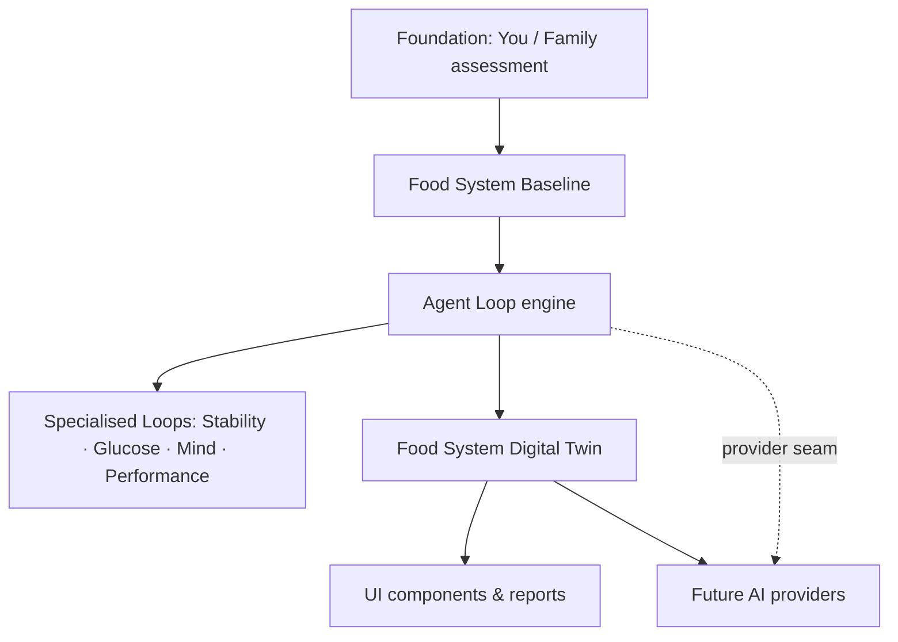
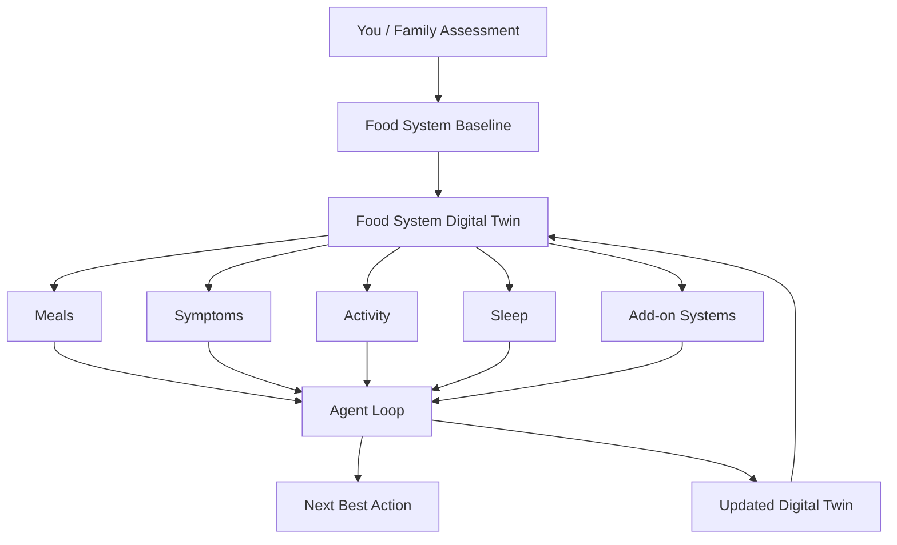
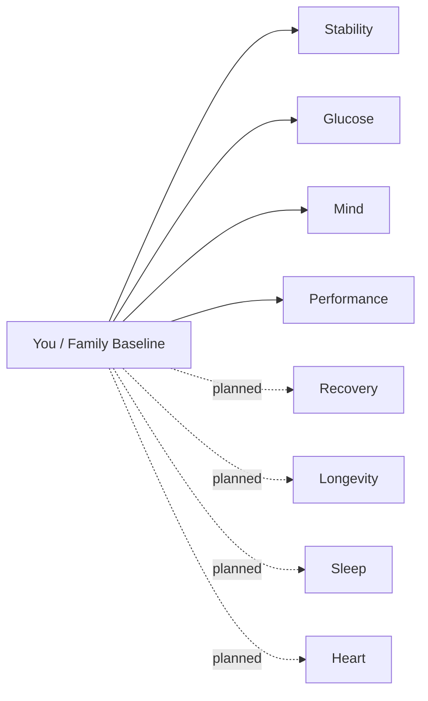

# EatoBiotics Agent Loop — Architecture

> The canonical design reference for the EatoBiotics Agent Loop and the Food
> System Digital Twin. Read this before extending the loop. Code lives in
> `lib/agent-loop/` (domain + engine), `components/agent-loop/` (UI), and
> `app/food-system-loop/` (demo).

---

## 1. Vision

EatoBiotics is **The Food System Inside You** — not a one-time quiz. Historically
the journey ended at a report:

> Assessment → Report → Finished

The Agent Loop turns that into a **living Food System** that keeps improving:

> Assess → Understand → Observe → Analyse → Recommend → Improve → Learn → Repeat

The loop **is the product intelligence.** An AI model (Claude, OpenAI, …) is an
*interchangeable execution engine* plugged in behind one interface — never a
dependency. Everything works deterministically today: no LLM, no network, no
database. This keeps EatoBiotics **product-first and AI-ready**.

The long-term differentiator: every meal, observation, symptom, assessment, and
add-on **enriches a single living object** — the user's **Food System Digital
Twin**, grounded in their original baseline. EatoBiotics becomes a continuously
learning health platform, not a collection of assessments.

---

## 1a. Product principles

**The Dashboard is the Primary Product Surface.** The Account page is no longer an
"account management" page — it is the customer's living Food System. Settings, billing,
and profile remain important but are **supporting** functionality, not the centre. The
Food System Dashboard (the Account overview, fed by the Digital Twin) is the default
destination after login: signing in should feel like returning to your Food System.

**The Four Questions.** Every customer interaction should help answer one of:
1. What is the current state of my Food System?
2. What changed since I last visited?
3. What is my single most valuable next action?
4. How am I improving over time?

If every screen answers one of these, the product feels like a living Food System rather
than a collection of assessments and reports.

## 2. The Core Loop

| Stage | Responsibility |
|-------|----------------|
| **Assess** | Complete the You or Family foundation → creates the Food System Baseline. |
| **Understand** | Food System Score + three-biotics profile; strengths, gaps, priorities. |
| **Observe** | Ingest a meal, symptom, energy, sleep, activity, or assessment update. |
| **Analyse** | Compare the observation to the baseline + history; detect trends. |
| **Recommend** | Exactly **one** food-first, achievable, non-medical next action. |
| **Improve** | Measure movement vs earlier loops; surface momentum, not perfection. |
| **Learn** | Record what was done/ignored + outcomes; adjust future recommendations. |
| **Repeat** | Any meal, check-in, or assessment starts the loop again. |

Stages are **product state**, not AI prompts. Implemented as a state machine in
`lib/agent-loop/stages.ts` (`STAGE_ORDER`, `nextStage`, `STAGE_META`). After
`learn` the loop returns to `observe`.

---

## 3. Domain Model

All models are pure and dependency-free (`lib/agent-loop/types.ts`). Relationships:

```
FoodSystemBaseline (immutable root)
 ├─ FoodSystemScore        value + band + label
 └─ BioticsScore           prebiotics / probiotics / postbiotics (+ strongest/weakest)

AgentLoopSession           one running loop for a baseline + system
 ├─ baseline               the FoodSystemBaseline it inherits
 ├─ system                 "foundation" | a specialised AddOnSystem key
 ├─ currentStage           AgentLoopStage
 ├─ turns[]                AgentLoopTurn (observation→analysis→recommendation→result+usage)
 ├─ memory                 FoodSystemMemory (Learn layer)
 └─ controls               LoopControls (maxTurns, allowedObservations)

FoodSystemDigitalTwin      DERIVED, read-only projection over a session (§5)
```

| Model | Purpose |
|-------|---------|
| **FoodSystemBaseline** | Immutable root from the You/Family assessment. Parent of every interaction; carries the score, biotics, strengths, gaps, priorities. |
| **FoodSystemScore** | `{ value 0–100, band, label }` (band from `lib/scoring.ts`). |
| **BioticsScore** | The three biotics, each `{ score, label }`, plus derived `strongest`/`weakest`. |
| **AgentLoopSession** | A running loop: baseline + system + stage + turns + memory + controls. |
| **AgentLoopStage** | Union of the eight stages. |
| **AgentLoopObservation** | One input — discriminated by `kind` (`meal_*`, `digestion`, `energy`, `cravings`, `sleep`, `activity`, `symptom`, `assessment_update`, `addon_assessment`). Extensible: new sources = new union members. |
| **AgentLoopAnalysis** | `{ changes, trends, improving, needsAttention, relatedBiotic?, rationale }`. |
| **AgentLoopRecommendation** | Exactly one `{ action, why, category: "food-first", targetBiotic?, effort, disclaimer }`. |
| **AgentLoopResult** | The "what now": `{ stage, score, progress, recommendation, summary, usage }` — mirrors the Claude Agent SDK result. |
| **FoodSystemMemory** | Learn layer: `{ completed[], ignored[], outcomes[], preferences }`. |
| **AddOnSystem** | Foundation or specialised system metadata: `{ key, label, kind, status, requiresFoundation, loop, blurb }`. |
| **FoodSystemDigitalTwin** | Derived, read-only projection (see §5). |
| *supporting* | `AgentLoopTurn`, `LoopProgress`, `LoopControls`, `LoopUsage`. |

---

## 4. Food System Baseline — the immutable foundation

The **Food System Baseline** is the user's foundational truth.

- **Created** from the You or Family assessment (`lib/agent-loop/baseline.ts`
  adapts the existing assessment registry + scoring — no scoring is duplicated).
- **Immutable**: it changes *only* when the user intentionally refreshes/retakes
  their baseline assessment. Day-to-day observations never mutate it.
- **Inherited**: every specialised system (Stability, Glucose, …) builds on it.
  No specialised system can run without it — enforced in the engine
  (`createAgentLoopSession`) and in the UI (`components/assessment/foundation-guard.tsx`).

Because the baseline is stable, everything derived from it is reproducible.

---

## 5. Food System Digital Twin — the living projection

The **Food System Digital Twin** is a *derived, read-only* representation of the
user's living Food System — the digital twin of their nutritional state. It is
**not** another assessment and **not** persisted (this phase). It is built
deterministically from a session (`lib/agent-loop/twin/`).

It combines, in one object:

- the immutable **baseline**
- **currentScore** (enriched by reassessments)
- the **biotics** profile
- all **observations** (meals, symptoms, energy, sleep, activity, …)
- **trends** (score direction, momentum, cadence)
- the **activeSystem** + **currentStage**
- the **nextBestAction** + full **recommendations** history
- **memory** (Learn) and **progress** (Improve)

```ts
const twin = buildFoodSystemTwin(session) // pure, deterministic
```

**The Twin is the single object the UI, reports, and future AI providers consume.**
The engine itself reasons over the Twin: `runLoop` builds it into the
`ProviderContext`, so a provider reads one coherent object instead of stitching
baseline + history + memory together.

### Why a derived read model (not persisted) now
- **Deterministic & low-risk** — same session ⇒ same Twin; nothing new to keep in
  sync, no migration, no backend dependency.
- **Stable interface** — consumers code against `FoodSystemDigitalTwin` today; the
  *source* behind it can change later (localStorage → Supabase → AI-enriched)
  **without touching consumers or the domain model**.
- **Baseline stays the source of truth** — the Twin is a projection of it, so we
  can evolve the projection freely while the foundation stays trustworthy.

---

## 6. Architecture diagrams

### (a) Layered overview


### (b) The Digital Twin flow


### (c) Add-on inheritance


---

## 7. Add-on architecture

Every specialised system **inherits the You/Family baseline** and never runs
standalone (`lib/agent-loop/systems.ts`). Each carries a `LoopConfig`
(`focusBiotic`, `observes`).

| System | Status | Focus biotic |
|--------|--------|--------------|
| Stability | **live** | postbiotics |
| Glucose | **live** | prebiotics |
| Mind | **live** | probiotics |
| Performance | **live** | postbiotics |
| Recovery | planned | postbiotics |
| Longevity | planned | prebiotics |
| Sleep | planned | probiotics |
| Heart | planned | prebiotics |

Live systems map 1:1 to the existing assessment registry (`ADDON_KEYS`); a unit
test asserts they stay in sync. Planned systems are **metadata only** — never
shown with fabricated scores ("Coming soon").

---

## 8. Folder structure

```
lib/agent-loop/
  types.ts        pure domain models
  stages.ts       8-stage state machine
  systems.ts      foundations + specialised systems (live/planned, inheritance)
  biotics.ts      SubScores -> BioticsScore (strongest/weakest, food hints)
  baseline.ts     completed foundation -> FoodSystemBaseline
  derive.ts       shared pure read helpers (current score, progress)
  safety.ts       non-diagnostic language guard + disclaimers
  engine.ts       pure immutable loop passes; controls; memory; summaries
  storage.ts      localStorage-first persistence + server-sync seam (stub)
  twin/
    twin-types.ts     FoodSystemDigitalTwin + FoodSystemTrend
    twin-builder.ts   buildFoodSystemTwin(session) — derived, deterministic
    index.ts
  providers/
    provider.ts       LoopIntelligenceProvider interface (the AI seam)
    deterministic.ts  default rule-based provider (used now)
    README.md         how to add Claude/OpenAI
  index.ts        public surface (import from here)

components/agent-loop/   reusable UI (timeline, stage, biotics, next action,
                         memory, FoodSystemLoopCard, result-page drop-in panel,
                         useFoodSystemLoop hook — exposes the Twin)
components/home/food-system-loop-section.tsx   homepage "The Food System Loop"
app/food-system-loop/    public interactive demo (deterministic, no auth)
```

---

## 9. Future integrations

All of these plug into existing seams **without changing the domain model or the
`FoodSystemDigitalTwin` interface** — consumers keep reading the same Twin.

| Integration | Where it plugs in |
|-------------|-------------------|
| **localStorage** | `storage.ts` (already the default). |
| **Supabase** | `storage.syncToServer()` (currently a no-op); add `agent_loop_sessions` + RLS, mirror `lib/stability/storage.ts`. The Twin is still *derived* from the rehydrated session. |
| **Claude Agent SDK** | implement `LoopIntelligenceProvider` (`providers/claude.ts`) + `lib/ai-guard.ts`; pass to `runLoop`. |
| **OpenAI / Vercel AI Gateway** | another `LoopIntelligenceProvider` implementation. |
| **Meal image analysis** | a new `ObservationKind` feeding `analyse()`. |
| **Wearables / health integrations** | new `ObservationKind`s (sleep, activity, HR) → same loop. |
| **Stripe entitlements** | gate `runAddOnLoop` per tier via `lib/membership.ts`. |
| **Email / push** | trigger off `AgentLoopResult` + the Twin's `progress`/`nextBestAction`. |

The Twin interface is intentionally provider-agnostic — no AI type leaks into it.

---

## 10. Safety

The loop never diagnoses or claims to treat disease (`lib/agent-loop/safety.ts`).

- Recommendations are **food-first**, achievable, and **non-diagnostic**; each
  carries `LOOP_DISCLAIMER`.
- Preferred language: *supports*, *may help*, *food patterns*, *general wellbeing*.
- `isNonDiagnostic()` guards copy (asserted in tests); `withDisclaimer()` appends
  the standard disclaimer idempotently.
- Red-flag symptoms point to a healthcare professional; the same guardrails will
  wrap any future AI provider's output before it is returned.

---

## 11. Current status

| Area | Status |
|------|--------|
| Domain models (`types.ts`) | ✅ Implemented |
| Stage machine (`stages.ts`) | ✅ Implemented |
| Systems registry — 4 live | ✅ Implemented |
| Systems registry — 4 planned | 🟡 Metadata only (no assessments yet) |
| Baseline + biotics adapters | ✅ Implemented |
| Deterministic engine + controls | ✅ Implemented |
| Safety framework | ✅ Implemented |
| **Food System Digital Twin (derived)** | ✅ Implemented |
| Provider interface + DeterministicProvider | ✅ Implemented |
| UI components + `useFoodSystemLoop` (Twin-aware) | ✅ Implemented |
| Homepage section + `/food-system-loop` demo | ✅ Implemented |
| Result-page drop-in panel | 🟡 Scaffolded (not mounted on the live paid result page) |
| localStorage persistence | ✅ Implemented · server-sync 🟡 stubbed |
| AI providers (Claude/OpenAI) | ⛔ Planned (seam ready) |
| Supabase persistence / Stripe gating / meal-image / wearables | ⛔ Planned (seams ready) |

Tests: `tests/unit/agent-loop.test.ts`, `tests/unit/agent-loop-twin.test.ts`.
```
✅ implemented   🟡 scaffolded / partial   ⛔ planned
```
